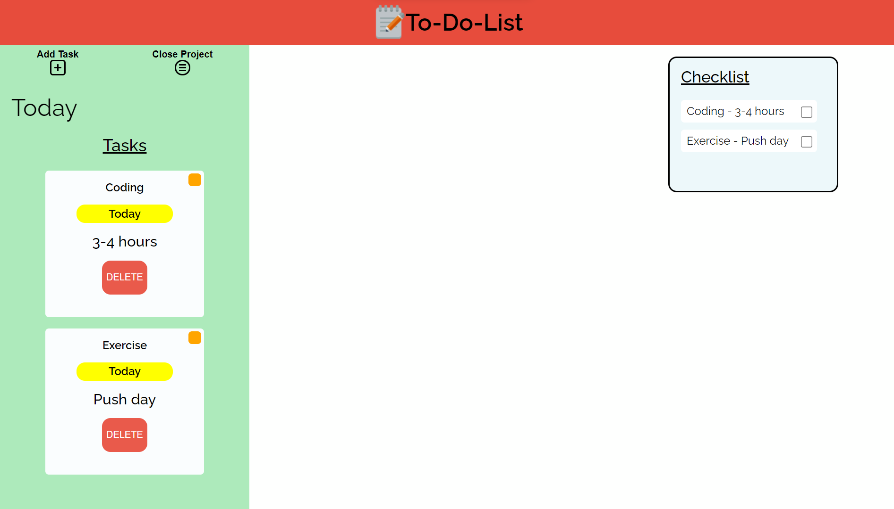

# To-Do-List JS

## Screenshots

</img>
</img>

## Description

A JavaScript application that helps you get your priorities in check

**Features:**

- Modern User Interface
- Intuitive Design
- Project To-Do's
- Interactive Checklist

## What I've Learnt

- Understanding and applying the MVC architecture
- Using asynchronous functions (Promises)
- Building reusable object contructors using ES6 classes
- & much more

## Installation

To use this project, first clone the repo on your device using the command below:

`git init`

`https://github.com/tarwat-uddin/get-to-do-list.git`

## License

[GNU General Public License version 3](https://opensource.org/licenses/GPL-3.0)
